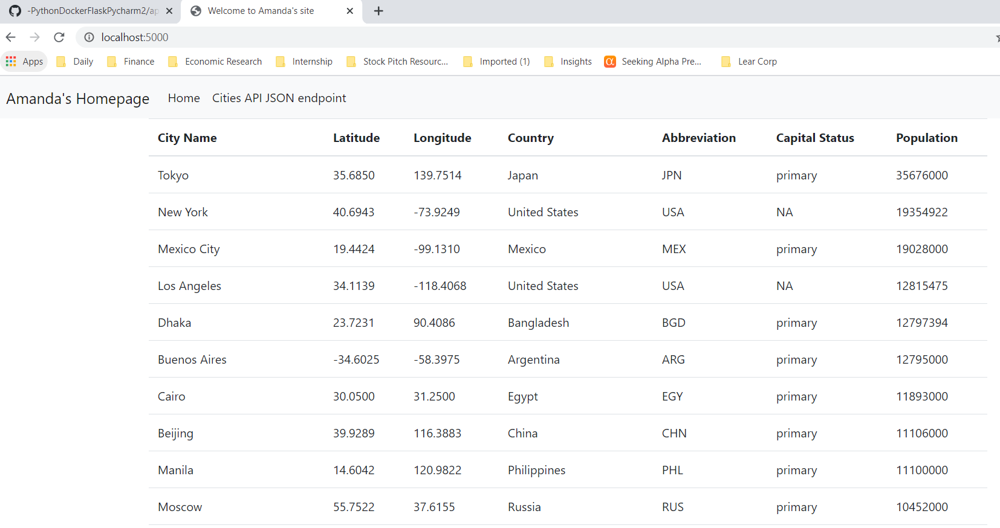

# Project Description
This project is a homework assignment to teach how to get Pycharm setup with Docker, Flask, MySQL, and Postman

## SQL Database Screenshot

## Postman Screenshot

## Homepage screenshot
